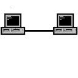
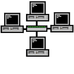
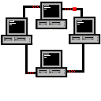
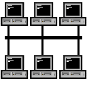

# Netzwerktopologien

## Point-to-Point

### Vorteile

- Bei jeder Verbindung wird die maximale bandbreite des Datenträgers ausgenutzt. Leicht Erweiterbar
- Leicht Verständlich
- Leichtes Traceback von Fehlern
- Kein Routing benötigt

### Nachteile

- Max. 2 Nodes (Knotenpunkte)
  - Mit mehr als 2 Nodes sind es andere Topologien (-> Routing wird Benötigt).
- Wird meist nur bei geringer Entferung der Nodes Genutzt.
- Wenn die Verbindung unterbrochen wird ist das Netzwerk kaputt.

## Baum / Stern

### Vorteile

- Einfach erweiterbar (=> Baum Topologie)
- Wenigsten Leitungen Benötigt (n Rechner: n-1 Kabel)
- Wenn eine Verbindung unterbrochen wird ist das Netzwerk immernoch voll-funktional
- Daten Passieren *nur* einen Rechner (Knoten-rechner) bevor sie ankommen

### Nachteile

- Wenn der Knoten-rechener ausfällt ist das Netzwerk kaputt

## Token-Ring

### Vorteile

- Einfach erweiterbar (zwischen zwei Rechnern rein)
- keine Package-kollision
- Wenn eine einzige Verbindung unterbrochen wird ist das Netzwerk noch funktional.
- Relativ geringer Kabelaufwand (n+1 Kabel)

### Nachteile

- Langsam
- Packages werden im schlimmsten fall von allen anderen Rechnern gelesen

## Bus

### Vorteile

- Keine Package Kollision
- Relativ geringer Kabelaufwand (n+1 Kabel)
- Einfach erweiterbar (Rechner an Hauptkabel. Verbinden)
- Wenn ein Rechner seine Verbindung verliert ist das immer noch Netwerk funktional
  
### Nachteile

- nur einer kann gleichzeitig senden
- alle können die Daten lesen

## Wie Große Netzwerke Entstehen

Man kann durch sog. Verbindungsrechner (~ Switches) mehrere Topologien verbinden.  
