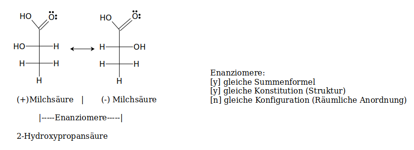

# Optische Aktivität

## Experimentelle Bestimmung: Perimeter

Aufbau: 
.svg.png)

1. Light source  
2. Unpolarized light  
3. Linear polarizer  
4. Linearly polarized light  
5. Sample tube containing molecules under study  
6. Optical rotation due to molecules  
7. Rotatable linear analyzer  
8. Detector  

Der Drehwinkel &alpha; um den der Lichtstrahl vom Molekül gedreht wird, 
wird durch den Winkel bestimmt, um den man den Analysator (7) drehen muss.

````java
double alpha = experiment.getAlpha();
if (alpha > 0 && alpha < 180) 	return "Rechtsdrehend";
else 							return "Linksdrehend ";
````

````markdown
Optisch aktive Substanzen sind in der lage,
die Schwingebene Monochromatischem (=Polarisierten)
Lichts zu Drehen.
````

&Sigma; Ursache: Molekülstruktur

## Die Chiralit&auml;t



Die Chiralität braucht ein Chiralitätszentrum, Also ein C-Atom mit *4-Verschiedenen* Substituenten (bspw. CH&#x2803;, H, OH, COOH), das mit **C\*** gekennzeichet wird. 

- Asymmetrisches C-Atom => Chirale Moleküle sind Optisch aktiv

! ***Diese Asymmetrische Anordnung kann schlimme Folgen haben, s. Contagan-Babies***

